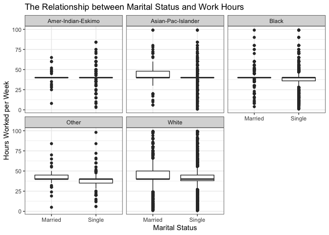

# Task 1: Choosing a dataset
We choose the [Adult Income](https://archive.ics.uci.edu/ml/datasets/adult) data set to analyze for the group project.

# Task 2. Project Proposal and EDA
## 2.1 Introduce and describe your dataset

Who: The data set was extracted by Barry Becker from the 1994 Census database and is donated by Silicon Graphics 
What: The data set contains the predicted income of individuals from the census based on attributes including age, marital status, work class, education, sex, and race.
When: The data is from a 1994 census.
Why: The data set is found in the University of California Irvine Machine Learning Repository so it is primarily used for learning.
How: The census data was collected by humans.

|Variable|Type|Description|
|--------|-------|------|
|age|||
|workclass|||
|education|||
|educationnum|||
|marital_status|||
|occupation|||
|relationship|||
|race|||
|sex|||
|capital_gain|||
|capital_loss|||
|hours_per_week|||
|country|||
|income|||


## Task 2.2: Load your dataset (from a file or URL).

```r
adult_income <- read_csv("adult.data.csv", col_names=FALSE)
```


```r
head(data)
```

```
## # A tibble: 6 x 15
##     age workclass fnlwgt education education_num marital_status occupation
##   <dbl> <chr>      <dbl> <chr>             <dbl> <chr>          <chr>     
## 1    39 State-gov  77516 Bachelors            13 Never-married  Adm-cleri…
## 2    50 Self-emp…  83311 Bachelors            13 Married-civ-s… Exec-mana…
## 3    38 Private   215646 HS-grad               9 Divorced       Handlers-…
## 4    53 Private   234721 11th                  7 Married-civ-s… Handlers-…
## 5    28 Private   338409 Bachelors            13 Married-civ-s… Prof-spec…
## 6    37 Private   284582 Masters              14 Married-civ-s… Exec-mana…
## # … with 8 more variables: relationship <chr>, race <chr>, sex <chr>,
## #   capital_gain <dbl>, capital_loss <dbl>, hours_per_week <dbl>,
## #   country <chr>, income <chr>
```

## Task 2.3: Explore your dataset
Perform some exploratory data analysis (EDA) to understand your dataset better. Some questions to consider:

How many variables are present?

```r
ncol(data)
```

```
## [1] 15
```

```r
nrow(data)
```

```
## [1] 32561
```
There are 15 variables, and 32461 observations (people)

What is the range of values for each numerical variable?

```r
sum_df <-data.frame(Age=integer(),Education=integer(),Hours=integer(),Capital_Gain=integer(),Capital_Loss=integer())
means <-summarise(data, mean_age=mean(age), mean_education_level = mean(education_num), mean_hoursPerWeek = mean(hours_per_week)) %>% round(2)
max <- summarise(data, max_age=max(age), max_education_level = max(education_num), max_hoursPerWeek = max(hours_per_week))  %>% round(2)
min <- summarise(data, min_age=min(age), min_education_level = min(education_num), min_hoursPerWeek = min(hours_per_week))  %>% round(2)
std_dev <- summarise(data, sd_age=sd(age), sd_education_level = sd(education_num), sd_hoursPerWeek = sd(hours_per_week))  %>% round(2)
NAs <- data %>% select(age, education_num,hours_per_week,capital_gain,capital_loss) %>% sapply(function(x) sum(length(which(is.na(x)))))
sum_df[1,] <- means[1,]
sum_df[2,] <- max[1,]
sum_df[3,] <- min[1,]
sum_df[4,] <- std_dev[1,]
sum_df[5,] <-NAs
rownames(sum_df) <- c("Mean","Max", "Min", "Standard Deviation", "Number NAs")

sum_df
```

```
##                      Age Education Hours Capital_Gain Capital_Loss
## Mean               38.58     10.08 40.44        38.58        10.08
## Max                90.00     16.00 99.00        90.00        16.00
## Min                17.00      1.00  1.00        17.00         1.00
## Standard Deviation 13.64      2.57 12.35        13.64         2.57
## Number NAs          0.00      0.00  0.00         0.00         0.00
```


How many unqiue values and NAs in each categorical variable:

```r
categorical_df <-data.frame(Work_Class=integer(),Marital_Status=integer(),Occupation=integer(),Relationship=integer(),Race=integer(),Country=integer())

Unique <-summarise(data, unique_work=length(unique(na.omit(age))), unique_MS=length(unique(na.omit(marital_status))), unique_occupation=length(unique(na.omit(occupation))), unique_relationships=length(unique(na.omit(relationship))), unique_race=length(unique(na.omit(race))), unique_country=length(unique(na.omit(country)))) %>% as.data.frame()

NAs <- data %>% select(workclass, marital_status, occupation, relationship, race, country) %>% sapply(function(x) sum(length(which(is.na(x)))))

categorical_df[1,] <- Unique[1,]
categorical_df[2,] <- NAs
rownames(categorical_df) <- c("Unqiue Values", "Number NAs")

categorical_df
```

```
##               Work_Class Marital_Status Occupation Relationship Race Country
## Unqiue Values         73              7         14            6    5      41
## Number NAs          1836              0       1843            0    0     583
```


Plotting Data
=======

Distribution of age for men and women:

```r
df <-select(data, sex, age) %>% mutate(sex = factor(sex, levels=c("Male", "Female"))) %>% group_by(sex)  %>% summarize(mean=mean(age))


data %>% mutate(sex = factor(sex, levels=c("Male", "Female"))) %>%
  ggplot(aes(x=age,fill=sex)) + 
  geom_histogram(alpha=0.8,position="identity") +
  #geom_vline(data=df,aes(xintercept=mean,color=sex,linetype="dashed"))+
  scale_fill_manual(values=c("skyblue2","deeppink4")) + 
  labs(title="Distribution of Age by Sex",x="Age",y="Count") +
  theme_bw() +
  theme(legend.title=element_blank())
```

<!-- -->


Proportion of people making >50K a year for men and women, by race:

```r
df <- data %>% select(sex,education_num,income,race)
df$educ[df$education_num < 10] <- "PS"  #for Post-secondary
df$educ[df$education_num >= 10] <- "HS"  #for High School

df %>% filter(income =="over_50K") %>% select(race,educ,sex) %>% group_by(race,educ,sex) %>% tally() %>%
  ggplot(aes(sex, n, fill=educ)) +
  geom_bar(position="fill", stat="identity") +
 # scale_y_continuous(labels=percent()) +
  theme_bw() +
  scale_fill_manual(values=c("skyblue2","deeppink4"),labels=c("High School","Post-Secondary")) + 
  facet_wrap(~race) +
  labs(title="Education level of people making over 50K",fill="Education",y="Percent",x="Sex")
```

<!-- -->


## Task 2.4: Research question & plan of action
1. With your data set and your EDA, identify at least one research question that you will attempt to answer with analyses and visualizations. Clearly state the research question and any natural sub-questions you need to address, and their type. The main research question should be either descriptive or exploratory.
Below are some descriptions of descriptive or exploratory research questions, adapted by Dr. Timbers from the Art of Data Science by Roger Pengand Elizabeth Matsui. 

*Exploratory Research Questions* 

2. Propose a plan of how you will analyze the data (what will you plot, which variables will you do a linear regression on?)
