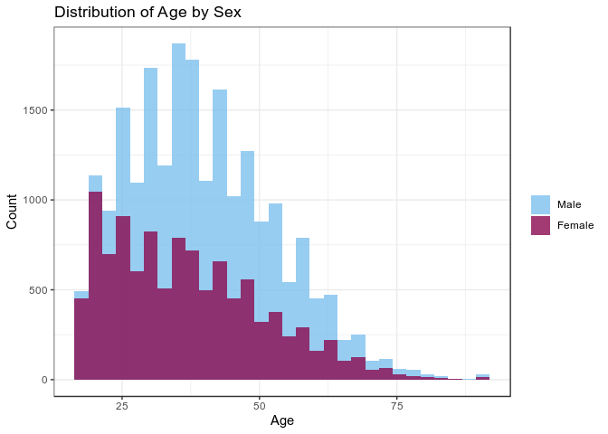
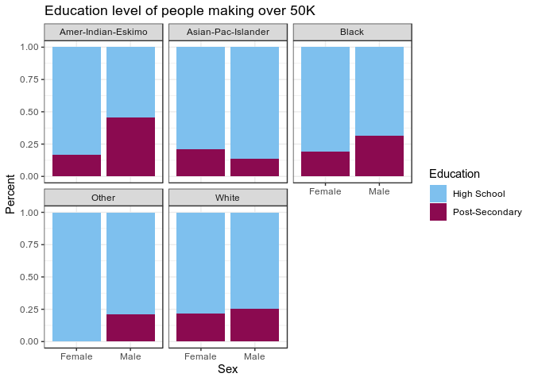
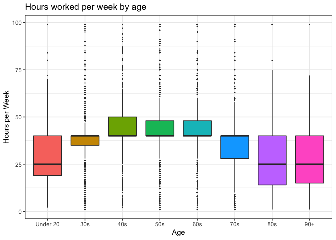
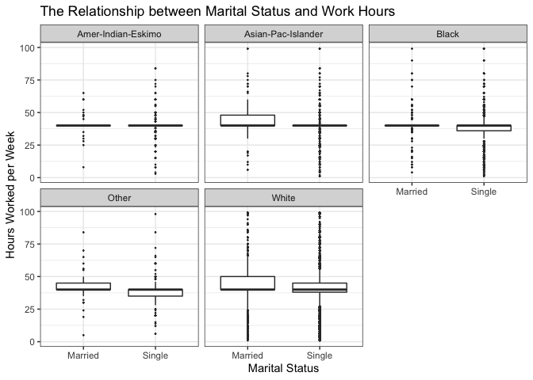

# Task 1: Choosing a dataset
We choose the [Adult Income](https://archive.ics.uci.edu/ml/datasets/adult) data set to analyze for the group project. 

# Task 2. Project Proposal and EDA
## 2.1 Introduce and describe your dataset

Who: The data set was extracted by Barry Becker from the 1994 Census database and is donated by Silicon Graphics \
What: This is a multivariate dataset with categorical and integer variables. It contains the predicted income of individuals from the census with attributes including age, marital status, work class, education, sex, and race. \
When: The data is from a 1994 census. \
Why: The data set is found in the University of California Irvine Machine Learning Repository, and was used for ML prediction of whether a person makes over or under 50K a year based on their attributes. \
How: The census data was collected by survey. 


|Variable|Type|Description|
|--------|-------|------|
|age|int|Age of individual|
|workclass|chr|e.g. private, self-emplowed, federal government, never worked, etc.|
|fnlwgt|int|Final weights: weighted sums of the socio-economic characteristics of the individual. People with similar demographics have similar weights. |
|education|chr|Highest education recieved|
|educationnum|factor|Numerical code for highest education recieved|
|marital_status|int|e.g. married, never married, divorced, etc.|
|occupation|chr|Occupation of individual|
|relationship|chr|Relation of individual in family. e.g. wife, child, husband, unmarried|
|race|chr|Asian-Pacific Islander, Native American, White, Black, other|
|sex|chr|Male or Female|
|capital_gain|int|Profit from capital assets such as investments, real estate, etc.|
|capital_loss|int|Loss from capital assets|
|hours_per_week||Hours the individual works per week|
|country|chr|Country of origin|
|income|chr|Whether individual is predicted to make over or under 50K|


## Task 2.2: Load your dataset (from a file or URL).

```r
adult_income <- read_csv("adult.data.csv", col_names=FALSE)
```


```r
#To add appropriate column names and change "?" to "NA", and change eduction number to factor

data <- adult_income %>% rename("age"=X1,"workclass"=X2,"fnlwgt"=X3,"education"=X4,
                        "education_num"=X5,"marital_status"=X6,"occupation"=X7,"relationship"=X8,
                        "race"=X9,"sex"=X10,"capital_gain"=X11,"capital_loss"=X12,"hours_per_week"=X13,
                        "country"=X14,"income"=X15) %>%    #give appropriate column names
  mutate(income=recode(income, ">50K"="over_50K", "<=50K"="under_50K")) %>%
  mutate_at(vars("workclass","education","marital_status","occupation","relationship","race","sex","country"), na_if, "?")  
data$education_num <-as.factor(data$education_num)
```


```r
head(as.tibble(data))
```

```
## # A tibble: 6 x 15
##     age workclass fnlwgt education education_num marital_status occupation
##   <dbl> <chr>      <dbl> <chr>     <fct>         <chr>          <chr>     
## 1    39 State-gov  77516 Bachelors 13            Never-married  Adm-cleri…
## 2    50 Self-emp…  83311 Bachelors 13            Married-civ-s… Exec-mana…
## 3    38 Private   215646 HS-grad   9             Divorced       Handlers-…
## 4    53 Private   234721 11th      7             Married-civ-s… Handlers-…
## 5    28 Private   338409 Bachelors 13            Married-civ-s… Prof-spec…
## 6    37 Private   284582 Masters   14            Married-civ-s… Exec-mana…
## # … with 8 more variables: relationship <chr>, race <chr>, sex <chr>,
## #   capital_gain <dbl>, capital_loss <dbl>, hours_per_week <dbl>,
## #   country <chr>, income <chr>
```


## Task 2.3: Explore your dataset
Perform some exploratory data analysis (EDA) to understand your dataset better. 


**How many variables are present?**

```r
ncol(data)
```

```
## [1] 15
```

```r
nrow(data)
```

```
## [1] 32561
```
There are 15 variables, and 32461 observations (people) 


It shows that there are 15 columns, but only 14 variables. And these variables are as follows (education and education_num are similar):

```r
colnames(data)
```

```
##  [1] "age"            "workclass"      "fnlwgt"         "education"     
##  [5] "education_num"  "marital_status" "occupation"     "relationship"  
##  [9] "race"           "sex"            "capital_gain"   "capital_loss"  
## [13] "hours_per_week" "country"        "income"
```

There are 15 variables, and 32461 observations (people) 

**What is the range of values for each numerical variable?** 
_Note: Education_Number is a factor, as it is a numerical code for education. But here will change to integer first and treat as integer_

```r
sum_df <-data.frame(Age=integer(),Education=integer(),Hours=integer(),Capital_Gain=integer(),Capital_Loss=integer())
means <-summarise(data, mean_age=mean(age), mean_education_level = mean(as.integer(education_num)), mean_hoursPerWeek = mean(hours_per_week)) %>% round(2)
max <- summarise(data, max_age=max(age), max_education_level = max(as.integer(education_num)), max_hoursPerWeek = max(hours_per_week))  %>% round(2)
min <- summarise(data, min_age=min(age), min_education_level = min(as.integer(education_num)), min_hoursPerWeek = min(hours_per_week))  %>% round(2)
std_dev <- summarise(data, sd_age=sd(age), sd_education_level = sd(as.integer(education_num)), sd_hoursPerWeek = sd(hours_per_week))  %>% round(2)
NAs <- data %>% select(age, education_num,hours_per_week,capital_gain,capital_loss) %>% sapply(function(x) sum(length(which(is.na(x)))))
sum_df[1,] <- means[1,]
sum_df[2,] <- max[1,]
sum_df[3,] <- min[1,]
sum_df[4,] <- std_dev[1,]
sum_df[5,] <-NAs
rownames(sum_df) <- c("Mean","Max", "Min", "Standard Deviation", "Number NAs")

sum_df
```

```
##                      Age Education Hours Capital_Gain Capital_Loss
## Mean               38.58     10.08 40.44        38.58        10.08
## Max                90.00     16.00 99.00        90.00        16.00
## Min                17.00      1.00  1.00        17.00         1.00
## Standard Deviation 13.64      2.57 12.35        13.64         2.57
## Number NAs          0.00      0.00  0.00         0.00         0.00
```


**How many unqiue values and NAs in each categorical variable?**

```r
categorical_df <-data.frame(Work_Class=integer(),Marital_Status=integer(),Occupation=integer(),Relationship=integer(),Race=integer(),Country=integer())

Unique <-summarise(data, unique_work=length(unique(na.omit(age))), unique_MS=length(unique(na.omit(marital_status))), unique_occupation=length(unique(na.omit(occupation))), unique_relationships=length(unique(na.omit(relationship))), unique_race=length(unique(na.omit(race))), unique_country=length(unique(na.omit(country)))) %>% as.data.frame()

NAs <- data %>% select(workclass, marital_status, occupation, relationship, race, country) %>% sapply(function(x) sum(length(which(is.na(x)))))

categorical_df[1,] <- Unique[1,]
categorical_df[2,] <- NAs
rownames(categorical_df) <- c("Unqiue Values", "Number NAs")

categorical_df
```

```
##               Work_Class Marital_Status Occupation Relationship Race
## Unqiue Values         73              7         14            6    5
## Number NAs          1836              0       1843            0    0
##               Country
## Unqiue Values      41
## Number NAs        583
```


Plotting Data

**Distribution of age for men and women:**

```r
df <-select(data, sex, age) %>% mutate(sex = factor(sex, levels=c("Male", "Female"))) %>% group_by(sex)  %>% summarize(mean=mean(age))


data %>% mutate(sex = factor(sex, levels=c("Male", "Female"))) %>%
  ggplot(aes(x=age,fill=sex)) + 
  geom_histogram(alpha=0.8,position="identity") +
  #geom_vline(data=df,aes(xintercept=mean,color=sex,linetype="dashed"))+
  scale_fill_manual(values=c("skyblue2","deeppink4")) + 
  labs(title="Distribution of Age by Sex",x="Age",y="Count") +
  theme_bw() +
  theme(legend.title=element_blank())
```

<!-- -->

**Proportion of people making >50K a year for men and women, by race:**

```r
data_2 <- data
data_2$education_num <- as.integer(data_2$education_num)
df <- data_2 %>% select(sex, education_num,income,race)
df$educ[df$education_num < 10] <- "PS"  #for Post-secondary
df$educ[df$education_num >= 10] <- "HS"  #for High School, all values lower than or equal to 10

df %>% filter(income =="over_50K") %>% select(race,educ,sex) %>% group_by(race,educ,sex) %>% tally() %>%
  ggplot(aes(sex, n, fill=educ)) +
  geom_bar(position="fill", stat="identity") +
 # scale_y_continuous(labels=percent()) +
  theme_bw() +
  scale_fill_manual(values=c("skyblue2","deeppink4"),labels=c("High School","Post-Secondary")) + 
  facet_wrap(~race) +
  labs(title="Education level of people making over 50K",fill="Education",y="Percent",x="Sex")
```

<!-- -->


**Hours worked per week by age groups:**

```r
data_3 <- select(data, age, hours_per_week) %>% mutate(Age_level= case_when(age <20 ~ "Under 20",
                                                                       age <30 ~"30s",
                                                                       age <40 ~"40s",
                                                                       age <50 ~"50s",
                                                                       age <60 ~"60s",
                                                                       age <70 ~"70s",
                                                                       age <80 ~"80s",
                                                                       TRUE ~ "90+")) 
data_3 %>% mutate(Age_level =fct_relevel(Age_level,"Under 20")) %>%
  ggplot(aes(Age_level, hours_per_week,fill=Age_level)) +
  geom_boxplot(outlier.size=0.2) +
  labs(title="Hours worked per week by age", x="Age", y="Hours per Week") +
  theme_bw() +
  theme(legend.position="none")
```

<!-- -->


**The number of hours worked based on marital status grouped by race:**

```r
data %>% 
  select(hours_per_week,race,marital_status)%>%
  mutate(marital_status = case_when( 
    marital_status == c("Married-AF-spouse","Married-civ-spouse","Married-spouse-absent") ~ "Married",
    TRUE ~ "Single")) %>%
  ggplot()+
  geom_boxplot(aes(marital_status,hours_per_week), outlier.size=0.2) +
  labs(x="Marital Status",y="Hours Worked per Week",
    title="The Relationship between Marital Status and Work Hours")+
  facet_wrap(~race)+ 
  theme_bw()
```

<!-- -->


## Task 2.4: Research question & plan of action

In this analysis, we seek to determine the difference in socioeconomic factors such as age, education, sex, and marital status between individuals earning less than and those earning more than $50,000 a year.

**Research Questions and Plan** 

1. Is earing more than 50K correlated with the education level, marital status, and hours worked per week? 

* Logistic regression using categorical and continuous explanatory variables. 

* Plots showing the relationship between income and each variable separately. For example, we will perform a logistic regression to show the the difference between individuals earning more than 50,000 a year and those who don't using the educational level as the independent variable.


2. Is hours worked per week correlated with age, relationship, education level, or sex?

* Linear regression using categorical and continuous explanatory variables.

* Plots showing the relationship between hours worked and each variable separately. For example, we will use the linear regression model to explore how hours at work is related to variables such as age, relationship, education level, and sex.


