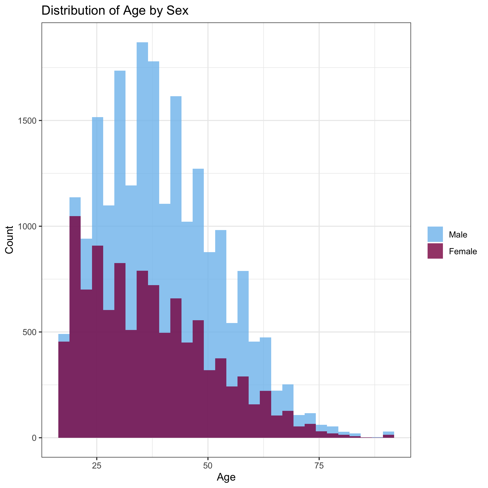
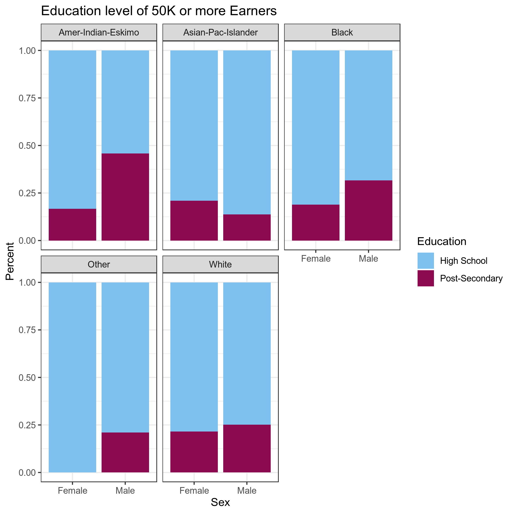

```{r setup, include=FALSE}
knitr::opts_chunk$set(echo = TRUE)
suppressPackageStartupMessages(library(broom))
suppressPackageStartupMessages(library(dplyr))
suppressPackageStartupMessages(library(ggplot2))
suppressPackageStartupMessages(library(tibble))
```

## Adult Income

## Introduction

### The Dataset
Who: The data set was extracted by Barry Becker from the 1994 Census database and is donated by Silicon Graphics \
What: This is a multivariate dataset with categorical and integer variables. It contains the predicted income of individuals from the census with attributes including age, marital status, work class, education, sex, and race. \
When: The data is from a 1994 census. \
Why: The data set is found in the University of California Irvine Machine Learning Repository, and was used for ML prediction of whether a person makes over or under 50K a year based on their attributes. \
How: The census data was collected by survey. 

### The Variables

|Variable|Type|Description|
|--------|-------|------|
|age|int|Age of individual|
|workclass|chr|e.g. private, self-emplowed, federal government, never worked, etc.|
|fnlwgt|int|Final weights: weighted sums of the socio-economic characteristics of the individual. People with similar demographics have similar weights. |
|education|chr|Highest education recieved|
|educationnum|factor|Numerical code for highest education recieved|
|marital_status|int|e.g. married, never married, divorced, etc.|
|occupation|chr|Occupation of individual|
|relationship|chr|Relation of individual in family. e.g. wife, child, husband, unmarried|
|race|chr|Asian-Pacific Islander, Native American, White, Black, other|
|sex|chr|Male or Female|
|capital_gain|int|Profit from capital assets such as investments, real estate, etc.|
|capital_loss|int|Loss from capital assets|
|hours_per_week||The number of hours that the individual works per week|
|country|chr|Country of origin|
|income|chr|Whether individual is predicted to make over or under 50K|

The single group used in the following analysis includes divorced, widowed, and never married individuals while the married group includes individials currently married (whether separated, together, or etc.)

### The Research Question and Method
**Are the number of hours someone works per week correlated with their age, relationship, education level or sex?**

Plots showing the relationship between hours worked and each variable separately. For example, we will use the linear regression model to explore how hours at work is related to variables such as age, relationship, education level, and sex.

## Exploratory Data Analysis

In this section, we will get to know our dataset better by exploring the relationship between certain factors.

### Age and Sex

The plot below shows that there are more male employees than female employees and that the majority of working males are older than working females since the male (blue curve) have a peak shifted to the right with respect to female (red peak).



### Educational Level and Income

We observe from the following graphs that a majority of individuals earning greater than $50,000 a year only accomplished high school irrespective of sex or ethnical background.


  
### Number of Work Hours and Age

We can deduce from the graph below that individuals work the most hours between their 40's and 60's (probably full time at 40 hours or more a week) and that employees under 20 and over 80 years of age work the same number of hours (probably part time at 25 hours)


### Marital Status and Number of Hours Worked

The plot below shows that the working hours between married individuals and single employees are similar.


## Linear Regression

We have performed linear regression of hours per week vs. each variable separately, as well as linear regression using all these variables together. 

This was done using the lm function of the purr package. For example: lm(hours_per_week~education,data) 

For categorical variables sex, education and relationship, the intercept is the defaul reference group, where the "estimate" is the mean of that group, and the "estimates" of all other variables are the differences in means between that group and the reference. The statistic is the t-statistic comparing these means, with a given p-value reporting the significance of this difference. 


```{r, readRDS,include=FALSE}
age <- readRDS("../data/hours_age.rds")
relationship <- readRDS("../data/hours_relationship.rds")
education <- readRDS("../data/hours_education.rds")
sex <- readRDS("../data/hours_sex.rds")
all <-readRDS("../data/hours_all.rds")
```

## Hypothesis and Results

#### Hours vs. Relationship

**Hypotheses:** Husbands work more than wives since wives are the primary care takers of the household. Unmarried and individuals not in a family work more than husbands or wives since they have more flexible schedules and more time.

```{r,echo=FALSE}
tidy(relationship)
```

**Result:** In this case, we are comparing the mean hours worked per week of husbands (intercept) to each other relationship category. It appears that husbands work more than any other age group, (as seen by the negative estimates), with significant p-values in each case. 

#### Hours vs. Sex

**Hypothesis:** Males work more hours than women given that women tend to be the care takers of the household.

```{r,echo=FALSE}
tidy(sex)
w_hours<-tidy(sex)[["estimate"]][1]
m_hours<-tidy(sex)[["estimate"]][2]
```

**Result:** 
From this output, we can see that the average hours worked per week for women is `r round(w_hours,0)`, and men work `r round(m_hours,0)` more hours per week on average. 


#### Hours vs. Age

**Hypothesis:** Individuals start to increase work hours in their 20s as they begin a career and keep increasing or plateauing depending on their marital status until it declines at retirement (around 60 years old).

**Result:** 
```{r,echo=FALSE}
tidy(age)
```
Age 


#### Hours vs. Education

**Hypothesis:** Higher educational attainment provides job security and stability leading to more work hours for higher educated individuals.

```{r,echo=FALSE}
tidy(education)
hours_11<-abs(tidy(education)[["estimate"]][2])
```

**Results:**
In this analysis, the default reference group (intercept) is a 10th grade education. It appears that those with an 11th grade education work `r round(hours_11,0)` hours less (significant p-value), whereas all other with no more than a high school education work the same amount (no significant p-values). 

Every other education level higher than highschool worked significantly more hours, as seen by positive estimates of each group and low p-values. 


#### All Variables 
```{r,echo=FALSE}
head(tidy(all))
```


## Discussion
Overall we believe a there is a more informative way to analyze our research question than the default lm() parameters. 

Our data is quite biased in that there are much more men (21790) than women (10771) in data set. This is especially apparent at older ages, for instance there are 742 women over 60 and 1590 men over 60. 

## Conclusion

More appropriate linear regression analysis need to be done
